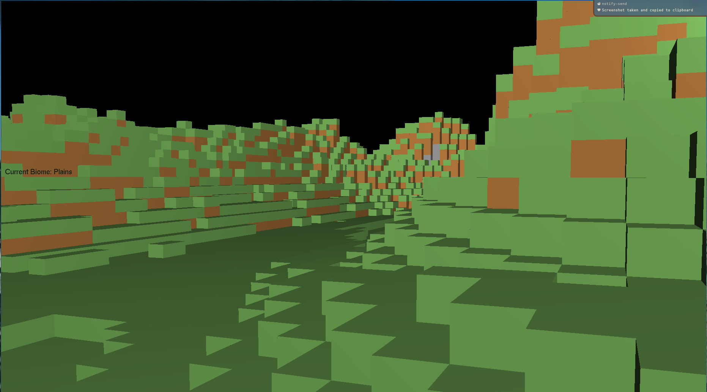

# kernelcraft


## Project Philosophy

KernelCraft aims to create a basic Minecraft clone using C and OpenGL. The primary focus is on understanding the fundamentals of 3D graphics programming and game development. By building a simple voxel-based game, we explore concepts such as rendering, world generation, and user interaction. The project is designed to be a learning tool, emphasizing clean code, modular design, and efficient use of resources. In the future I plan on adding features and designs that are more similar to CubeWorld.

## Libraries Used

- **OpenGL**: A cross-platform graphics API used for rendering 2D and 3D vector graphics.
- **GLFW**: A library for creating windows, receiving input, and handling events. It simplifies the process of setting up an OpenGL context.
- **GLEW**: The OpenGL Extension Wrangler Library, which helps in managing OpenGL extensions.
- **GLUT**: The OpenGL Utility Toolkit, used for rendering text and other utilities.

## Project Structure

- **src/**: Contains the source code for the project.
  - **main.c**: The entry point of the application. It initializes the OpenGL context and handles the main rendering loop.
  - **graphics/**: Contains rendering-related code.
    - **cube.c**: Handles the creation and rendering of cube objects.
    - **camera.c**: Manages camera movement and orientation.
    - **shader.c**: Handles shader loading and compilation.
    - **frustum.c**: Implements frustum culling for optimization.
  - **math/**: Contains mathematical operations and utilities.
    - **math.c**: Implements vector and matrix operations, as well as Perlin noise generation.
  - **world/**: Contains world generation and management code.
    - **world.c**: Manages world generation and updates, including biome interpolation and terrain height calculation.
  - **utils/**: Contains utility functions and input handling.
    - **inputs.c**: Handles keyboard and mouse input processing.
    - **text.c**: Utility functions for rendering text.

## Features

- **Rendering**:
  - Basic rendering of cubes with lighting effects using shaders.
  - Frustum culling for optimization.
  - Dynamic text rendering for displaying FPS and biome information.

- **World Generation**:
  - Procedural terrain generation using Perlin noise.
  - Biome interpolation for varied terrain features.
  - Basic block types: air, grass, dirt, and stone.

- **User Interaction**:
  - Camera controls for navigation.
  - Mouse input for looking around.

## Getting Started

### Install Dependencies

Ensure you have OpenGL, GLFW, GLEW, and GLUT installed on your Linux system. Here are the installation instructions for Arch Linux:

- **Arch Linux**:
  ```bash
  sudo pacman -S glfw-wayland glew freeglut
  ```
  or if you are using X11:
  ```bash
  sudo pacman -S glfw-x11 glew freeglut
  ```

  ## Set the XDG_RUNTIME_DIR environment variable

  ```bash
  echo 'export XDG_RUNTIME_DIR=/run/user/$(id -u)' >> ~/.bashrc
  ```

### Build the Project

Use the provided `Makefile` to compile the source files. Run `make` in the project root directory.

### Run the Application

Execute the compiled binary to start the game.

### Stuck??

Use the ESC key to be able to use the cursor again.

## Roadmap
firewall
### Phase 1: Core Engine Development
- **Basic Rendering**: 
  - [x] Set up OpenGL context and render a simple cube
  - [x] Implement a basic camera system for navigation
  - [X] Basic render distance
  - [X] Implement frustum culling for basic optimization
  - [] Implement occlusion culling for better optimization
  - [X] Implement chunk-based rendering system
  - [X] Add basic shaders for lighting and shadows
  - [ ] Add support for transparency and alpha blending
  - [ ] Implement basic post-processing effects
  - [X] Add support for different render modes (wireframe, solid)
  - [ ] Create debug visualization tools
  - [ ] Optimize render batching and draw calls

- **World Generation**:
  - [X] Create a flat terrain using cubes
  - [X] Implement basic Perlin noise for height variation
    - [X] Increased world size to 128x128
    - [X] Enhanced terrain with more octaves and adjusted noise parameters
  - [X] Basic sine wave for height variation
  - [X] Add support for different cube types (dirt, stone, grass, etc.)
    - [X] Before textures, use different colors to represent different blocks
  - [X] Add multiple layers (dirt, stone, bedrock)
  - [X] Implement basic biome system **SHOULD BE WORKED ON LATER WITH A BETTER BIOME SYSTEM**
  - [ ] Randomly generated worlds with different seeds
  - [ ] Add cave generation using 3D noise
  - [ ] Add trees
  - [ ] Create water system with basic fluid physics
  - [ ] Bigger world size **SHOULD BE WORKED ON LATER**
  
- **User Interaction**:
  - [x] Implement basic controls for player movement
  - [x] Add mouse controls for looking around
  - [ ] Add block placement and destruction
  - [ ] Implement collision detection
  - [ ] Add player physics (gravity, jumping)
  - [ ] Create raycast system for block selection

### Phase 2: Graphics and Performance
- **Graphics Enhancements**:
  - [ ] Implement texture mapping and UV coordinates
  - [ ] Implement texture atlas system
  - [ ] Add basic lighting system
  - [ ] Implement ambient occlusion
  - [ ] Add day/night cycle
  - [ ] Create particle system for effects
  - [ ] Implement weather effects (rain, snow)
  - [ ] Add basic shadows
  - [ ] Create water shader with reflections
  - [ ] Add support for different render modes (wireframe, solid)
  - [ ] Add support for different camera modes (first person, third person)
  - [ ] Add support for skyboxes and clouds
- **Optimization**:
  - [ ] Implement greedy meshing for chunk rendering
  - [ ] Add level of detail system for distant chunks
  - [ ] Optimize memory usage for chunk storage
  - [ ] Implement multithreaded chunk generation
  - [ ] Add chunk compression
  - [ ] Create efficient chunk serialization system

### Phase 3: Gameplay Features
- **World Interaction**:
  - [ ] Add inventory system
  - [ ] Implement crafting system
  - [ ] Create basic UI system
  - [ ] Add health and hunger mechanics
  - [ ] Implement tool durability
  - [ ] Add block metadata system

- **Entity System**:
  - [ ] Create basic entity framework
  - [ ] Add passive mobs (animals)
  - [ ] Implement hostile mobs
  - [ ] Add pathfinding system
  - [ ] Create AI behavior system
  - [ ] Implement mob spawning mechanics

### Phase 4: Advanced Features
- **Multiplayer**:
  - [ ] Implement basic networking architecture
  - [ ] Add client-server communication
  - [ ] Create player synchronization
  - [ ] Implement chunk synchronization
  - [ ] Add basic chat system
  - [ ] Create player authentication

- **World Management**:
  - [ ] Add world saving/loading
  - [ ] Implement seed-based world generation
  - [ ] Create world backup system
  - [ ] Add world settings and configuration
  - [ ] Implement world border system

- **Modding Support**:
  - [ ] Create basic mod API
  - [ ] Implement resource pack system
  - [ ] Add scripting support
  - [ ] Create mod loading system
  - [ ] Add configuration API

### Phase 5: Polish and Extra Features
- **Audio System**:
  - [ ] Implement basic sound engine
  - [ ] Add ambient sounds
  - [ ] Create music system
  - [ ] Add positional audio
  - [ ] Implement sound effects for actions

- **Visual Effects**:
  - [ ] Add screen effects (damage, underwater)
  - [ ] Implement block breaking animation
  - [ ] Create item pickup animations
  - [ ] Add status effect visuals
  - [ ] Implement environmental effects

- **Quality of Life**:
  - [ ] Add key binding system
  - [ ] Create settings menu
  - [ ] Implement performance options
  - [ ] Add accessibility features
  - [ ] Create tutorial system

- **Misc.**:
  - [ ] Add logging system
  - [ ] Create documentation
  - [ ] Add fire bugs mob
  - [ ] Add Tony Chase as a mob
    - [ ] Special funny Tony sounds when he gets hit or dies
  - [ ] Add goblin mob 
## License

This project is licensed under the GNU General Public License v3.0. See the LICENSE file for more details.
