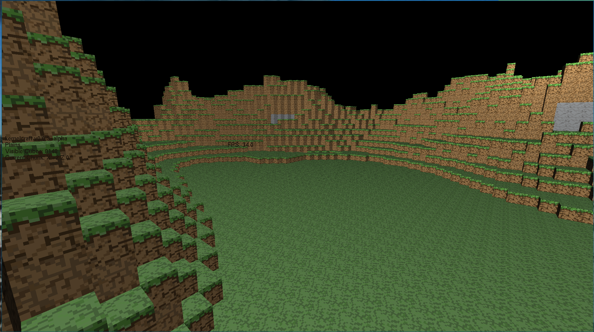

# kernelcraft


Screenshot of version v0.0.2




Screenshot of version v0.0.4

## Project Philosophy

KernelCraft aims to create a basic Minecraft clone using C and OpenGL. The primary focus is on understanding the fundamentals of 3D graphics programming and game development. By building a simple voxel-based game, we explore concepts such as rendering, world generation, and user interaction. The project is designed to be a learning tool, emphasizing clean code, modular design, and efficient use of resources. In the future I plan on adding features and designs that are more similar to CubeWorld.

## Libraries Used

- **OpenGL**: A cross-platform graphics API used for rendering 2D and 3D vector graphics.
- **GLFW**: A library for creating windows, receiving input, and handling events. It simplifies the process of setting up an OpenGL context.
- **GLEW**: The OpenGL Extension Wrangler Library, which helps in managing OpenGL extensions.
- **GLUT**: The OpenGL Utility Toolkit, used for rendering text and other utilities.
- **stb_image**: A single-file public domain library for loading images in various formats.

## Project Structure

- **src/**: Contains the source code for the project.
  - **main.c**: The entry point of the application. It initializes the OpenGL context and handles the main rendering loop.
  - **graphics/**: Contains rendering-related code.
    - **cube.c**: Handles the creation and rendering of cube objects.
    - **camera.c**: Manages camera movement and orientation.
    - **shader.c**: Handles shader loading and compilation.
    - **frustum.c**: Implements frustum culling for optimization.
    - **texture.c**: Implements texture loading and binding.
  - **math/**: Contains mathematical operations and utilities.
    - **math.c**: Implements vector and matrix operations, as well as Perlin noise generation.
  - **world/**: Contains world generation and management code.
    - **world.c**: Manages world generation and updates, including biome interpolation and terrain height calculation.
  - **utils/**: Contains utility functions and input handling.
    - **inputs.c**: Handles keyboard and mouse input processing.
    - **text.c**: Utility functions for rendering text.

## Features

- **Rendering**:
  - Basic rendering of cubes with lighting effects using shaders.
  - Frustum culling for optimization.
  - Dynamic text rendering for displaying FPS and biome information.

- **World Generation**:
  - Procedural terrain generation using Perlin noise.
  - Biome interpolation for varied terrain features.
  - Basic block types: air, grass, dirt, and stone.

- **User Interaction**:
  - Camera controls for navigation.
  - Mouse input for looking around.

## Getting Started

### Install Dependencies

Ensure you have OpenGL, GLFW, GLEW, and GLUT installed on your Linux system. Here are the installation instructions for Arch Linux:

- **Arch Linux**:
  ```bash
  sudo pacman -S glfw-wayland glew freeglut
  ```
  or if you are using X11:
  ```bash
  sudo pacman -S glfw-x11 glew freeglut
  ```

  ## Set the XDG_RUNTIME_DIR environment variable

  ```bash
  echo 'export XDG_RUNTIME_DIR=/run/user/$(id -u)' >> ~/.bashrc
  ```

### Build the Project

Use the provided `Makefile` to compile the source files. Run `make` in the project root directory.

### Run the Application

Execute the compiled binary to start the game.

### Stuck??

Use the ESC key to be able to use the cursor again.

## Roadmap

### Phase 1: Core Engine Development
- **Basic Rendering**:
  - [x] Set up OpenGL context and render a simple cube
  - [x] Implement a basic camera system for navigation
  - [x] Basic render distance
  - [x] Implement frustum culling for basic optimization
  - [x] Implement occlusion culling for better optimization **MAIN FOCUS**
  - [x] Implement chunk-based rendering system
  - [x] Add basic shaders for lighting and shadows
  - [ ] Implement basic post-processing effects
  - [x] Add support for different render modes (wireframe, solid)
  - [ ] Create debug visualization tools
  - [ ] Optimize render batching and draw calls

- **World Generation**:
  - [x] Create a flat terrain using cubes
  - [x] Implement basic Perlin noise for height variation
    - [x] Increased world size to 256x256
    - [x] Enhanced terrain with more octaves and adjusted noise parameters
  - [x] Basic sine wave for height variation
  - [x] Add support for different cube types (dirt, stone, grass, etc.)
    - [x] Before textures, use different colors to represent different blocks
  - [x] Add multiple layers (dirt, stone, bedrock)
  - [x] Implement basic biome system **(To be enhanced with a more detailed biome system)**
  - [ ] Randomly generated worlds with different seeds
  - [ ] Add cave generation using 3D noise
  - [ ] Add trees
  - [ ] Create water system with basic fluid physics
  - [ ] Expand world size **(Planned for later phases)**

- **User Interaction**:
  - [x] Implement basic controls for player movement
  - [x] Add mouse controls for looking around
  - [ ] Add block placement and destruction
  - [ ] Implement collision detection
  - [ ] Add player physics (gravity, jumping)
  - [ ] Create raycast system for block selection

### Phase 2: Graphics and Performance
- **Graphics Enhancements**:
  - [x] Implement texture mapping and UV coordinates
    - [x] Fix grass texture mapping using the grass top for the top, and sides.
  - [wip] Implement texture atlas system
    - [x] Create atlas image from textures using a Python script.
    - [ ] Integrate texture atlas into rendering pipeline
  - [ ] Add support for transparency and alpha blending
  - [ ] Add support for skyboxes and clouds 
  - [ ] Add advanced lighting systems (ambient occlusion, dynamic shadows)
  - [ ] Add day/night cycle
  - [ ] Create particle system for effects
  - [ ] Implement weather effects (rain, snow)
  - [ ] Create water shader with reflections and refractions
  - [ ] Add support for different camera modes (first person, third person)
  - [ ] Add support for CRT screen effects, curvature, scanlines, chromatic aberration, and vignette

- **Optimization**:
  - [ ] Implement voxel-like meshes using OpenGL meshes
  - [ ] Implement greedy meshing for chunk rendering to reduce draw calls
  - [ ] Add level of detail (LOD) system for distant chunks
  - [ ] Optimize memory usage for chunk storage
  - [ ] Implement multithreaded chunk generation for smoother performance
  - [ ] Add chunk compression to reduce memory footprint
  - [ ] Create efficient chunk serialization and deserialization system

### Phase 3: Gameplay Features
- **World Interaction**:
  - [ ] Add inventory system
  - [ ] Implement crafting system
  - [ ] Create a basic UI system for inventory and crafting
  - [ ] Add health and hunger mechanics
  - [ ] Implement tool durability
  - [ ] Add block metadata system for more complex interactions

- **Entity System**:
  - [ ] Create a basic entity framework for mobs and animals
  - [ ] Add passive mobs (e.g., animals)
  - [ ] Implement hostile mobs
  - [ ] Add pathfinding system for mob navigation
  - [ ] Create AI behavior system for entities
  - [ ] Implement mob spawning mechanics based on biomes and environment

### Phase 4: Advanced Features
- **Multiplayer**:
  - [ ] Implement basic networking architecture
  - [ ] Add client-server communication protocols
  - [ ] Create player synchronization for multiplayer experiences
  - [ ] Implement chunk synchronization across clients
  - [ ] Add a basic chat system for player communication
  - [ ] Create player authentication and session management

- **World Management**:
  - [ ] Add world saving and loading functionality
  - [ ] Implement seed-based world generation for reproducible worlds
  - [ ] Create a world backup and recovery system
  - [ ] Add world settings and configuration options for customization
  - [ ] Implement a world border system to limit exploration

- **Modding Support**:
  - [ ] Create a basic mod API to allow community extensions
  - [ ] Implement a resource pack system for custom textures and sounds
  - [ ] Add scripting support for dynamic content creation
  - [ ] Create a mod loading and management system
  - [ ] Add a configuration API for mod settings and options

### Phase 5: Polish and Extra Features
- **Audio System**:
  - [ ] Implement a basic sound engine for ambient sounds and effects
  - [ ] Add ambient sounds corresponding to different biomes and environments
  - [ ] Create a music system for background tracks
  - [ ] Add positional audio for immersive experiences
  - [ ] Implement sound effects for player actions and environmental interactions

- **Visual Effects**:
  - [ ] Add screen effects such as damage flashes and underwater visuals
  - [ ] Implement block breaking and placement animations
  - [ ] Create item pickup and drop animations
  - [ ] Add status effect visuals for player buffs and debuffs
  - [ ] Implement environmental effects like fog and dynamic lighting

- **Quality of Life**:
  - [ ] Add a key binding system for customizable controls
  - [ ] Create a settings menu for graphics, audio, and control configurations
  - [ ] Implement performance options to cater to different hardware capabilities
  - [ ] Add accessibility features such as colorblind modes and adjustable UI sizes
  - [ ] Create a tutorial system to guide new players through the game mechanics

- **Miscellaneous**:
  - [ ] Add a comprehensive logging system for debugging and analytics
  - [ ] Create detailed documentation for developers and users
  - [ ] Add unique mobs like Fire Bugs with special abilities
  - [ ] Introduce special characters like Tony Chase as unique mobs
    - [ ] Implement special funny Tony sounds when he gets hit or dies
  - [ ] Add additional mobs such as Goblins with distinct behaviors
  - [ ] Introduce unique blocks like the Cupid Sponge for special interactions

### Phase 6: Testing and Deployment
- **Testing**:
  - [ ] Conduct thorough playtesting to identify and fix bugs
  - [ ] Implement automated testing for critical game systems
  - [ ] Optimize performance across different hardware configurations
  - [ ] Gather user feedback to guide further development

- **Deployment**:
  - [ ] Prepare installation packages for various operating systems
  - [ ] Set up distribution channels for the game
  - [ ] Implement update mechanisms for seamless patching
  - [ ] Launch the game and monitor for post-release issues

## License

This project is licensed under the GNU General Public License v3.0. See the LICENSE file for more details.
