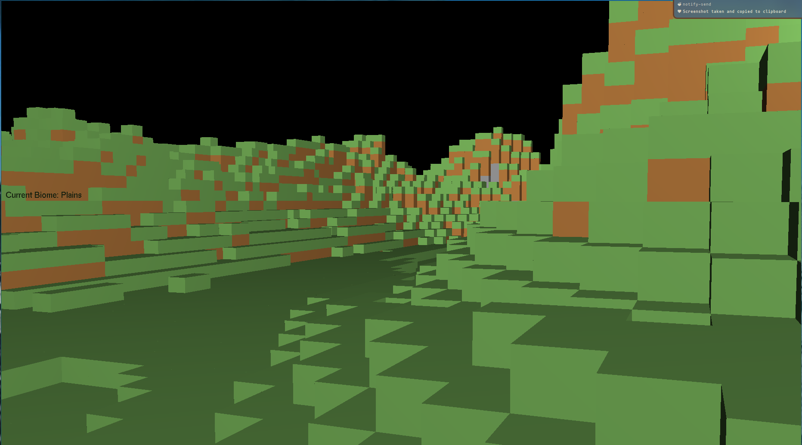
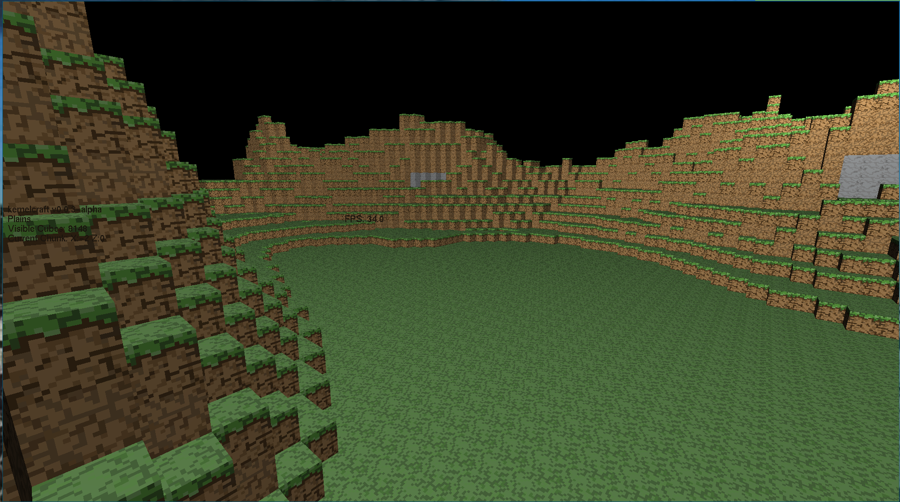

# kernelcraft



Screenshot of version v0.0.2




Screenshot of version v0.0.4

## Project Philosophy

kernelcraft aims to create a basic Minecraft clone using C and OpenGL. The primary focus is on understanding the fundamentals of 3D graphics programming and game development. By building a simple voxel-based game, we explore concepts such as rendering, world generation, and user interaction. The project is designed to be a learning tool, emphasizing clean code, modular design, and efficient use of resources. In the future I plan on adding features and designs that are more similar to CubeWorld.

## Libraries Used

- **OpenGL**: A cross-platform graphics API used for rendering 2D and 3D vector graphics.
- **GLFW**: A library for creating windows, receiving input, and handling events. It simplifies the process of setting up an OpenGL context.
- **GLEW**: The OpenGL Extension Wrangler Library, which helps in managing OpenGL extensions.
- **GLUT**: The OpenGL Utility Toolkit, used for rendering text and other utilities.
- **stb_image**: A single-file public domain library for loading images in various formats.

## Project Structure

- **src/**: Contains the source code for the project.
  - **main.c**: The entry point of the application. It initializes the OpenGL context and handles the main rendering loop.
  - **assets/**: Contains assets like shaders and textures.
  - **graphics/**: Contains rendering-related code.
    - **world_renderer.c**: Rebuilds dirty chunk meshes and draws visible texture batches.
    - **camera.c**: Manages camera movement and orientation.
    - **hud.c**: Provides a basic hud and debug management system.
    - **shader.c**: Handles shader loading and compilation.
    - **frustum.c**: Implements frustum culling for optimization.
    - **texture.c**: Implements texture loading and binding.
  - **math/**: Contains mathematical operations and utilities.
    - **math.c**: Implements vector and matrix operations, as well as Perlin noise generation.
  - **world/**: Contains world generation and management code.
    - **world.c**: Manages world generation and updates, including biome interpolation and terrain height calculation.
    - **chunk.c**: Converts between world, block, and chunk coordinates.
    - **cube.c**: Defines cube face positions, normals, and texture coordinates.
    - **mesh.c**: Builds indexed chunk meshes from exposed block faces.
    - **player.c**: Fixed-step movement, voxel collision, jumping, and safe spawning.
  - **utils/**: Contains utility functions and input handling.
    - **inputs.c**: Handles keyboard and mouse input processing.
    - **text.c**: Utility functions for rendering text.
    - **raycast.c**: Bounded DDA selection with hit faces and placement cells.

## Features

- **Rendering**:
  - Basic rendering of cubes with lighting effects using shaders.
  - Frustum culling for optimization.
  - Dynamic text rendering for displaying FPS and biome information.

- **World Generation**:
  - Procedural terrain generation using Perlin noise.
  - Biome interpolation for varied terrain features.
  - Basic block types: air, grass, dirt, and stone.

- **User Interaction**:
  - Walking with gravity, grounded jumps, solid-block collision, and safe spawning.
  - Explicit debug flight for inspecting and editing terrain.
  - Mouse input for looking around.
  - Block placement and destruction, a target outline, crosshair, and three-slot material selector.

## Getting Started

### Windows

Install the native compiler and libraries using the [Windows setup guide](docs/windows.md), then run this from PowerShell in the repository:

```powershell
.\build.cmd -Run
```

The build copies assets and required DLLs beside `bin\windows\Release\minecraft_clone.exe`. Use `.\build.cmd -Test` for native Windows tests or `.\build.cmd -Benchmark` for the rendering benchmark. WSL is not required.

### Linux

On Ubuntu (including Ubuntu under WSL), install the development packages:

```sh
sudo apt-get install build-essential pkg-config libglfw3-dev libglew-dev freeglut3-dev
make -j4
make run
```

On Arch, install a C compiler, GNU Make, pkgconf, GLFW, GLEW, and freeglut for
your display environment. Run from a desktop session with a working OpenGL
3.3 compatibility driver. The existing FreeGLUT text renderer needs the legacy
OpenGL API; macOS core-only 3.3 contexts are not supported. Do not change shell startup files to manufacture display-session variables.

Both platforms compile C11 with `-Wall -Wformat=2 -Wstrict-prototypes`.
Linux Release uses `-O2 -g`; `make CONFIGURATION=Debug` uses `-O0 -g3`.
Executables, assets, and objects are separated by platform and configuration:
`bin/linux/Release/minecraft_clone` and `obj/linux/Release/`, or the corresponding
`Debug` directories. `make clean` removes only the selected Linux configuration.
Old artifacts directly under `bin/` and `obj/` are no longer used.

The Linux executable locates its directory through `/proc/self/exe` and changes
to it before loading assets. It can be launched from another working directory;
keep the adjacent `assets` directory with it. Windows uses the same layout.

Linux dependency discovery uses `pkg-config`. Set `PKG_CONFIG_PATH` for a custom
installation, or supply both `GRAPHICS_CPPFLAGS` and `GRAPHICS_LDLIBS` explicitly.
The Makefile honors `CC`, `CPPFLAGS`, `CFLAGS`, `LDFLAGS`, and `LDLIBS`.
Changes to compiler/flags or included headers invalidate existing objects.
For example, `make CC=clang CFLAGS='-O1 -g -Werror'` rebuilds with Clang.
Concurrent builds should use different configurations or separate checkouts.

### Checks and current status

```sh
make test              # CPU world, mesh, edit, DDA, and player regressions; no graphics dependencies
make test-sanitize     # CPU checks with AddressSanitizer and UBSan
sudo apt-get install clang xvfb xauth
make test-build        # Real incremental/configuration builds in a temporary copy
make test-gl           # Hidden application, shader, texture, and rendering checks
```

CPU tests need only a C compiler, Make, and the math library; they include no
OpenGL or GLFW headers and create no window. The graphical tests use Mesa/Xvfb
on Linux and the installed driver on Windows. These are distinct from interactive
playtesting. See [player movement status](docs/player-movement.md), [block editing checkpoint](docs/block-editing.md), [build checkpoint](docs/status.md), [Windows setup](docs/windows.md),
and [rendering checks](docs/performance.md).

The game starts in walking mode at a clear position above terrain. W/A/S/D walks
at 4.5 world units/second; mouse motion looks around. Space jumps once per press
while grounded. Diagonal movement has the same speed, and looking up/down does
not change walking speed. Solid blocks and the finite world's boundaries stop
the player. Jump to climb a one-block step; automatic stepping is not implemented.

F toggles debug flight, where W/A/S/D follows the camera and Space/Left Shift
moves up/down through terrain. Returning to walking keeps the current body
position if clear, or finds a standing surface near that column. The HUD shows
movement mode, grounded/airborne state, and completed simulation steps per frame.

Escape toggles mouse capture and pauses movement. Focus loss releases the cursor;
press Escape after returning to resume. Minimized windows also pause. The first
mouse sample after capture is discarded to avoid a turn jump. Left click destroys
the target; right click places on its face. Keys 1/2/3 select grass, dirt, and
stone. Each press edits once within six world units; a gold outline marks the
selected block. Placement rejects occupied/out-of-world cells and body overlap
in both modes. The body is 0.6 units wide and 1.8 high, with the eye 1.62 above
its feet; one block is one unit.

Physics advances at 120 Hz with at most eight steps per rendered frame; excess
elapsed time after a stall is discarded. Debug flight uses a 0.1-second frame
limit. See the movement checkpoint for collision boundaries and test coverage.
Selectable seeds and saves remain planned. **Edits are kept in memory and
disappear when the game closes.**

## Roadmap

### Phase 1: Core Engine Development
- **Basic Rendering**:
  - [x] Set up OpenGL context and render a simple cube
  - [x] Implement a basic camera system for navigation
  - [x] Basic render distance
  - [x] Implement frustum culling for basic optimization
  - [x] Remove faces between solid blocks, including chunk seams
  - [ ] Implement true occlusion culling
  - [x] Implement chunk-based rendering system
  - [x] Add basic shaders for lighting
  - [ ] Implement shadows
  - [ ] Implement basic post-processing effects
  - [ ] Add a wireframe toggle (solid rendering is implemented)
  - [x] Show FPS, submitted surface blocks, chunks, terrain draws, faces/triangles, and mesh update time
  - [x] Show completed simulation steps per frame and movement state
  - [x] Optimize render batching and draw calls

- **World Generation**:
  - [x] Create a flat terrain using cubes
  - [x] Implement basic Perlin noise for height variation
    - [x] Increased world size to 256x256
    - [x] Enhanced terrain with more octaves and adjusted noise parameters
  - [x] Basic sine wave for height variation
  - [x] Add support for different cube types (dirt, stone, grass, etc.)
    - [x] Before textures, use different colors to represent different blocks
  - [x] Add stone, dirt, and grass layers
  - [ ] Add bedrock
  - [x] Implement basic biome system **(To be enhanced with a more detailed biome system)**
  - [ ] Randomly generated worlds with different seeds
  - [ ] Add cave generation using 3D noise
  - [ ] Add trees
  - [ ] Create water system with basic fluid physics
  - [ ] Expand world size **(Planned for later phases)**

- **User Interaction**:
  - [x] Implement free-flight camera controls
  - [x] Add mouse controls for looking around
  - [x] Add block placement and destruction with dirty chunk updates
  - [x] Implement solid-voxel player collision and finite movement bounds
  - [x] Add player physics (gravity, grounded jumping, safe spawn)
  - [x] Add DDA selection, placement-face results, target outline, crosshair, and material selection

### Phase 2: Graphics and Performance
- **Graphics Enhancements**:
  - [x] Implement texture mapping and UV coordinates
    - [x] Fix grass texture mapping using the grass top for the top, and sides.
  - [ ] Integrate a texture atlas (the renderer currently batches four separate textures)
    - [x] Create atlas image from textures using a Python script.
    - [ ] Integrate texture atlas into rendering pipeline
  - [ ] Add support for transparency and alpha blending
  - [ ] Add support for skyboxes and clouds 
  - [ ] Add advanced lighting systems (ambient occlusion, dynamic shadows)
  - [ ] Add day/night cycle
    - [ ] Within the system implement tick based time
  - [ ] Create particle system for effects
  - [ ] Implement weather effects (rain, snow)
  - [ ] Create water shader with reflections and refractions
  - [ ] Add support for different camera modes (first person, third person)
  - [ ] Add support for CRT screen effects, curvature, scanlines, chromatic aberration, and vignette

- **Optimization**:
  - [x] Implement voxel-like meshes using OpenGL meshes
  - [ ] Implement greedy meshing for chunk rendering to reduce draw calls
  - [ ] Add level of detail (LOD) system for distant chunks
  - [x] Optimize memory usage for chunk storage
  - [ ] Implement multithreaded chunk generation for smoother performance
  - [ ] Add chunk compression to reduce memory footprint
  - [ ] Create efficient chunk serialization and deserialization system

### Phase 3: Gameplay Features
- **World Interaction**:
  - [ ] Add inventory system
  - [ ] Implement crafting system
  - [ ] Create a basic UI system for inventory and crafting
  - [ ] Add health and hunger mechanics
  - [ ] Implement tool durability
  - [ ] Add block metadata system for more complex interactions

- **Entity System**:
  - [ ] Create a basic entity framework for mobs and animals
  - [ ] Add passive mobs (e.g., animals)
  - [ ] Implement hostile mobs
  - [ ] Add pathfinding system for mob navigation
  - [ ] Create AI behavior system for entities
  - [ ] Implement mob spawning mechanics based on biomes and environment

### Phase 4: Advanced Features
- **Multiplayer**:
  - [ ] Implement basic networking architecture
  - [ ] Add client-server communication protocols
  - [ ] Create player synchronization for multiplayer experiences
  - [ ] Implement chunk synchronization across clients
  - [ ] Add a basic chat system for player communication
  - [ ] Create player authentication and session management

- **World Management**:
  - [ ] Add world saving and loading functionality
  - [ ] Implement seed-based world generation for reproducible worlds
  - [ ] Create a world backup and recovery system
  - [ ] Add world settings and configuration options for customization
  - [ ] Implement a world border system to limit exploration

- **Modding Support**:
  - [ ] Create a basic mod API to allow community extensions
  - [ ] Implement a resource pack system for custom textures and sounds
  - [ ] Add scripting support for dynamic content creation
  - [ ] Create a mod loading and management system
  - [ ] Add a configuration API for mod settings and options

### Phase 5: Polish and Extra Features
- **Audio System**:
  - [ ] Implement a basic sound engine for ambient sounds and effects
  - [ ] Add ambient sounds corresponding to different biomes and environments
  - [ ] Create a music system for background tracks
  - [ ] Add positional audio for immersive experiences
  - [ ] Implement sound effects for player actions and environmental interactions

- **Visual Effects**:
  - [ ] Add screen effects such as damage flashes and underwater visuals
  - [ ] Implement block breaking and placement animations
  - [ ] Create item pickup and drop animations
  - [ ] Add status effect visuals for player buffs and debuffs
  - [ ] Implement environmental effects like fog and dynamic lighting

- **Quality of Life**:
  - [ ] Add a key binding system for customizable controls
  - [ ] Create a settings menu for graphics, audio, and control configurations
  - [ ] Implement performance options to cater to different hardware capabilities
  - [ ] Add accessibility features such as colorblind modes and adjustable UI sizes
  - [ ] Create a tutorial system to guide new players through the game mechanics

- **Miscellaneous**:
  - [ ] Add a comprehensive logging system for debugging and analytics
  - [ ] Create detailed documentation for developers and users
  - [ ] Add unique mobs like Fire Bugs with special abilities
  - [ ] Introduce special characters like Tony Chase as unique mobs
    - [ ] Implement special funny Tony sounds when he gets hit or dies
  - [ ] Add additional mobs such as Goblins with distinct behaviors
  - [ ] Introduce unique blocks like the Cupid Sponge for special interactions

### Phase 6: Testing and Deployment
- **Testing**:
  - [ ] Conduct thorough playtesting to identify and fix bugs
  - [x] Add CPU world/math/mesh and graphical startup/render regressions
  - [x] Add CPU editing/DDA and running-application edit/pixel regressions
  - [x] Add CPU collision and application walking/jumping/pause regressions
  - [ ] Add persistence and restart regressions
  - [ ] Optimize performance across different hardware configurations
  - [ ] Gather user feedback to guide further development

- **Deployment**:
  - [ ] Prepare installation packages for various operating systems
  - [ ] Set up distribution channels for the game
  - [ ] Implement update mechanisms for seamless patching
  - [ ] Launch the game and monitor for post-release issues

## License

This project is licensed under the GNU General Public License v3.0. See the LICENSE file for more details.
