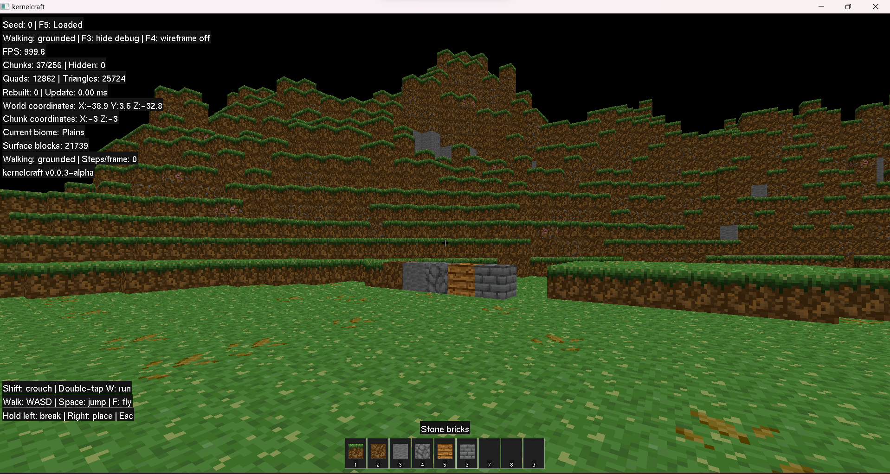

# kernelcraft



Screenshot of currentish build 

Textures & Art direction by @redwynn

## Project Philosophy

kernelcraft aims to create a basic Minecraft clone using C and OpenGL. The primary focus is on understanding the fundamentals of 3D graphics programming and game development. By building a simple voxel-based game, we explore concepts such as rendering, world generation, and user interaction. The project is designed to be a learning tool, emphasizing clean code, modular design, and efficient use of resources. In the future I plan on adding features and designs that are more similar to CubeWorld.

## Libraries Used

- **OpenGL**: A cross-platform graphics API used for rendering 2D and 3D vector graphics.
- **GLFW**: A library for creating windows, receiving input, and handling events. It simplifies the process of setting up an OpenGL context.
- **GLEW**: The OpenGL Extension Wrangler Library, which helps in managing OpenGL extensions.
- **GLUT**: The OpenGL Utility Toolkit, used for rendering text and other utilities.
- **stb_image**: A single-file public domain library for loading images in various formats.

## Project Structure

- **src/**: Contains the source code for the project.
  - **main.c**: The entry point of the application. It initializes the OpenGL context and handles the main rendering loop.
  - **assets/**: Contains assets like shaders and textures.
  - **graphics/**: Contains rendering-related code.
    - **world_renderer.c**: Rebuilds dirty chunk meshes and draws each visible chunk with shared texture-array materials.
    - **camera.c**: Manages camera movement and orientation.
    - **player_renderer.c**: Draws the skinned player body and first-person arm through a separate texture and shader.
    - **hud.c**: Draws gameplay status, a responsive hotbar, and F3 diagnostics.
    - **inventory_ui.c**: Draws inventory, crafting, tooltips, and a live equipped-player preview.
    - **shader.c**: Handles shader loading and compilation.
    - **frustum.c**: Implements frustum culling for optimization.
    - **texture.c**: Implements texture loading and binding.
  - **math/**: Contains mathematical operations and utilities.
    - **math.c**: Implements vector and matrix operations, as well as Perlin noise generation.
  - **world/**: Contains world generation and management code.
    - **world.c**: Manages world generation and updates, including biome interpolation and terrain height calculation.
    - **chunk.c**: Converts between world, block, and chunk coordinates.
    - **cube.c**: Defines cube face positions, normals, and texture coordinates.
    - **mesh.c**: Builds indexed greedy rectangles from compatible exposed block faces.
      [Measured rebuild improvements](docs/mesh-rebuild-performance.md) retain rectangle records to avoid a second greedy sweep.
    - **player.c**: Fixed-step movement, voxel collision, jumping, and safe spawning.
    - **player_model.c**: Skin UV layout, articulated body parts, movement poses, and timed hand animation.
    - **save.c**: Validated, versioned chunk and player snapshots with safe file replacement.
    - **inventory.c**: Stack ownership, equipment slots, transfers, and atomic 2×2 crafting.
    - **dropped_items.c**: Bounded item drops, voxel contact, and capacity-aware pickup.
  - **utils/**: Contains utility functions and input handling.
    - **inputs.c**: Handles keyboard and mouse input processing.
    - **text.c**: Utility functions for rendering text.
    - **raycast.c**: Bounded DDA selection with hit faces and placement cells.

## Features

- **Rendering**:
  - Basic rendering of cubes with lighting effects using shaders.
  - A 20-minute day/night cycle with dawn/dusk colors, an orbiting sun, all eight lunar phases, nighttime stars, and changing terrain light. See [cycle behavior and checks](docs/day-night-cycle.md).
  - Drifting blocky clouds with shaded sides, world parallax, and day/night lighting.
  - Filtered sun/moon terrain shadows and readable nighttime fill. See [shadow behavior](docs/terrain-shadows.md).
  - [Thickness-aware cloud transparency](docs/cloud-transparency.md), including overlapping cloud segments and translucent edges.
  - Frustum culling for optimization.
  - Conservative chunk occlusion from the current camera, including during movement. F3 shows hidden chunks; F4 wireframe bypasses occlusion.
  - A compact HUD with optional F3 diagnostics for FPS, world position, and rendering statistics. [Cached text rendering](docs/hud-performance.md) reduces the overlay's frame-time cost.
  - A six-part skinned player with optional outer layers, first-person hand, walking/running/crouching/airborne poses, and timed block-breaking punches. F6 cycles first-person, rear third-person, and front third-person views. See [player skins](docs/player-skins.md).

- **World Generation**:
  - Procedural terrain generation using Perlin noise and selectable 32-bit seeds.
  - Biome interpolation for varied terrain features.
  - Basic block types: air, grass, dirt, and stone.

- **User Interaction**:
  - Walking with gravity, grounded jumps, solid-block collision, and safe spawning.
  - Explicit debug flight for inspecting and editing terrain.
  - Mouse input for looking around.
  - Enter opens local chat with `/time set day`, `/time set night`, numeric time commands, and `/moon set` phase previews.
  - Block placement and destruction, a target outline, crosshair, and nine-slot hotbar with shaded 3D item icons.
  - E opens a 36-slot inventory with 2×2 crafting, armor/offhand slots, stack management, and an equipped-player preview. See [inventory controls and limits](docs/inventory.md).
  - Finite block stacks, collectible mined items, and Q/Ctrl-Q item drops.
  - Textured 3D blocks and shaped equipment in the inventory, world drops, and both hands. The empty main hand uses the supplied player skin.
  - F5 and clean-exit saves restore blocks, position, view, selected slot, inventory, equipment, crafting inputs, cursor items, and world drops.

## Getting Started

### Windows

Install the native compiler and libraries using the [Windows setup guide](docs/windows.md), then run this from PowerShell in the repository:

```powershell
.\build.cmd -Run
```

The build copies assets and required DLLs beside `bin\windows\Release\minecraft_clone.exe` and reuses compiled objects from `obj\windows\Release`. Use `.\build.cmd -Test` for native Windows tests or `.\build.cmd -Benchmark` for the rendering benchmark. WSL is not required.

### Linux

On Ubuntu (including Ubuntu under WSL), install the development packages:

```sh
sudo apt-get install build-essential pkg-config libglfw3-dev libglew-dev freeglut3-dev
make -j4
make run
```

On Arch, install a C compiler, GNU Make, pkgconf, GLFW, GLEW, and freeglut for
your display environment. Run from a desktop session with a working OpenGL
3.3 compatibility driver. The existing FreeGLUT text renderer needs the legacy
OpenGL API; macOS core-only 3.3 contexts are not supported. Do not change shell startup files to manufacture display-session variables.

Both platforms compile C11 with `-Wall -Wformat=2 -Wstrict-prototypes`.
Linux Release uses `-O2 -g`; `make CONFIGURATION=Debug` uses `-O0 -g3`.
Executables, assets, and objects are separated by platform and configuration:
`bin/linux/Release/minecraft_clone` and `obj/linux/Release/`, or the corresponding
`Debug` directories. `make clean` removes only the selected Linux configuration.
Old artifacts directly under `bin/` and `obj/` are no longer used.

The Linux executable locates its directory through `/proc/self/exe` and changes
to it before loading assets. It can be launched from another working directory;
keep the adjacent `assets` directory with it. Windows uses the same layout.

Linux dependency discovery uses `pkg-config`. Set `PKG_CONFIG_PATH` for a custom
installation, or supply both `GRAPHICS_CPPFLAGS` and `GRAPHICS_LDLIBS` explicitly.
The Makefile honors `CC`, `CPPFLAGS`, `CFLAGS`, `LDFLAGS`, and `LDLIBS`.
Changes to compiler/flags or included headers invalidate existing objects.
For example, `make CC=clang CFLAGS='-O1 -g -Werror'` rebuilds with Clang.
Concurrent builds should use different configurations or separate checkouts.

### Checks and current status

```sh
make test              # CPU world, movement, inventory, crafting, drops, saves, and CLI checks; no graphics dependencies
make test-sanitize     # CPU checks with AddressSanitizer and UBSan
sudo apt-get install clang xvfb xauth
make test-build        # Real incremental/configuration builds in a temporary copy
make test-gl           # Hidden application, HUD layout, restart, shader, texture, and rendering checks
```

CPU tests need only a C compiler, Make, and the math library; they include no
OpenGL or GLFW headers and create no window. The graphical tests use Mesa/Xvfb
on Linux and the installed driver on Windows. These are distinct from interactive
playtesting. See [Windows incremental builds](docs/windows-incremental-build.md), [texture-array integration](docs/texture-array.md), [shader startup validation](docs/shader-startup.md), [minimized input status](docs/minimized-input.md), [responsive HUD status](docs/responsive-hud.md), [greedy meshing status](docs/greedy-meshing.md), [seed and persistence status](docs/world-persistence.md), [player movement status](docs/player-movement.md), [block editing checkpoint](docs/block-editing.md), [build checkpoint](docs/status.md), [Windows setup](docs/windows.md),
and [rendering checks](docs/performance.md).

New worlds start in walking mode at a clear position above terrain; saved worlds resume at their stored feet position. W/A/S/D walks
at 4.5 world units/second; mouse motion looks around. Space jumps once per press
while grounded. Diagonal movement has the same speed, and looking up/down does
not change walking speed. Solid blocks and the finite world's boundaries stop
the player. Jump to climb a one-block step; automatic stepping is not implemented.

Hold either Shift key while walking to crouch at 1.5 units/second. The body
becomes one block high, with the eye 0.9 blocks above the feet, so it fits
one-block-high passages. Releasing Shift stands up only when the full body
fits; move out from under a ceiling to stand. Body and eye height change together
on a physics tick, without an animated transition. Grounded crouching prevents
walking off ledges, including diagonal corners. Release Shift or jump to leave
an edge; removing the supporting block still makes the player fall.

Double-tap W within 0.25 seconds (press to press, including the endpoint) to run
at 7 units/second while holding W. Running keeps the same collision and diagonal
speed limits and continues through a jump. Releasing W after starting a run,
pressing S or either Shift key, toggling flight, or pausing cancels the run and
tap history. Key repeats do not count as taps. After cancellation, start a fresh
double-tap to run again. See [crouch and running checks](docs/crouch-running.md).
Running also eases the field of view from 70 to 80 degrees, then back when it
stops. Pausing or entering debug flight restores 70 degrees immediately.

F toggles debug flight, where W/A/S/D follows the camera and Space/Left Shift
moves up/down through terrain. Returning to walking keeps the current body
position if clear, or finds a standing surface near that column. The HUD shows
movement mode and grounded/airborne state. F3 toggles detailed diagnostics,
including FPS, coordinates, simulation steps, and mesh statistics. It works
while the mouse is captured or released, without resuming movement.

F4 toggles terrain wireframe, showing the edges and diagonals of the submitted
mesh triangles with their existing materials. Unfilled faces reveal edges behind
them; selection still targets the nearest solid block. The HUD, hotbar, breaking
bar, and target overlay retain their normal appearance. F4 also works with the
cursor released, ignores key repeats and inactive windows, and keeps the chosen
mode through pauses and flight changes. Every launch starts with solid terrain.
See [wireframe controls and checks](docs/wireframe.md).

F6 cycles first-person, rear third-person, and front third-person views. Nearby
terrain shortens the third-person camera distance; tight spaces fall back to
first person. Movement, aiming, and edits still use the player's original eye
position. Camera mode lasts for the current session. The supplied skin, optional
outer layers, body poses, and first-person arm are described in [player skins](docs/player-skins.md).

Press Enter (or keypad Enter) to open chat, type a message or command, and
press Enter again to send. Backspace edits the line; Escape cancels it.
Typing pauses movement and the day/night clock and blocks mouse-look, block
edits, and gameplay shortcuts. Chat keeps the latest eight local messages
and responses. Opening it again shows that history; the latest response also
appears above the hotbar when space allows.

Use `/time set day` for noon (tick 6000), `/time set night` for midnight
(tick 18000), or `/time set 1200` to choose a specific tick. Numeric values
must be decimal integers from 0 through 23999. Invalid commands report usage
without changing time. Use `/moon set new`, `/moon set waxing-crescent`, or
`/moon set 0` through `/moon set 7` to preview the [eight lunar phases](docs/day-night-cycle.md#lunar-phases).
Time commands preserve the lunar phase; moon commands preserve the time of day.
Commands affect the current session; the cycle starts in the morning with a
full moon after a restart. Chat is local, with multiplayer
delivery planned. See [chat controls and checks](docs/local-chat.md).

The HUD fits its text and material slots to the framebuffer. Small windows use
smaller bitmap text and shorten long labels; diagnostics occupy available space
above the aiming area. More diagnostic rows appear in taller windows. Save
status remains visible with diagnostics hidden. Below 192 pixels wide or 120
high, the hotbar is hidden; control hints also disappear when space is too short.
This does not establish physical high-DPI scaling behavior.

E opens the inventory. Left/right click moves or splits stacks; drag distributes
items, Shift-click transfers or equips, and number keys swap with hotbar slots.
The four-square recipe turns four stone into four stone bricks. E or Escape
returns crafting/cursor items to storage, dropping any overflow. The equipped
player preview follows the pointer and fits the height of the armor column.
The world keeps running with inventory open: time, clouds, falling, and item
pickup continue while movement, looking, and editing controls are blocked.
[Inventory controls](docs/inventory.md)
describe offhand exchange, armor, drops, and full-storage behavior.

Outside inventory, Escape toggles mouse capture and pauses movement. Focus loss releases the cursor;
press Escape after returning to resume. Minimized windows pause rendering and
input even if their framebuffer size stays positive. Zero-size framebuffers
also pause. The first mouse sample after capture or an observed pause is
discarded to avoid a turn jump. Hold left mouse to break
the target; right click places on its face. Keys 1–9 select the corresponding
hotbar slot; the mouse wheel cycles them. New inventories have 999 grass, dirt,
stone, cobblestone, oak planks, and stone bricks in slots 1–6; slots 7–9 start
empty. Contents and counts change through crafting, transfers, pickup, and
placement. Empty slots can break blocks; placement can use the offhand when
the selected slot has no placeable block. A gold
border marks the selected slot. See [hotbar checks](docs/textured-hotbar.md).
Breaking by hand takes 0.2 seconds for oak leaves, 0.5 for dirt, 0.75 for grass
or leafy grass, 1 for oak planks, 1.5 for stone or oak logs, and 2 for
cobblestone or stone bricks. A gold bar above the
crosshair shows progress. Keep
aiming at the same block; releasing left mouse, losing or changing the target,
or changing its material discards partial progress. Changing hotbar slots,
right-clicking, toggling flight, or pausing also cancels the hold and requires
a fresh press. All current slots use the same hand rates in walking and flight.
Holding through completion starts the next target from zero; excess time never
carries over. The visible held block follows an asymmetric strike and recovery
path while breaking, so the recovery does not retrace the strike. Successful
placement plays a short swing in the hand that supplied the block; the final
item in a stack remains visible until that swing finishes. Tools and their speed
modifiers remain planned. See
[timed hand breaking](docs/timed-block-breaking.md) for timing and checks.

Each right press places once and consumes one item within six world units; breaking uses the same
reach. A gold outline marks the
selected block, including visible edges touching the floor or neighboring blocks. A faint gold tint marks the targeted face, keeping selection
visible under low ceilings when the outline is off-screen. See the
[selection highlighting checks](docs/selection-highlight.md). Placement rejects occupied/out-of-world cells and body overlap
in both modes, using the shorter body when crouched. The standing body is 0.6
units wide and 1.8 high, with the eye 1.62 above its feet; one block is one unit.

Physics advances at 120 Hz with at most eight steps per rendered frame; excess
elapsed time after a stall is discarded. Debug flight uses a 0.1-second frame
limit. See the movement checkpoint for collision boundaries and test coverage.

### Worlds and saves

New worlds include oak forests over the existing plains and hills heightmap.
Trees have upright bark-covered logs, end grain, and layered leaf canopies.
Leafy grass is much more common near trunks; harvesting it gives ordinary
grass. Logs and leaves can be collected, held, placed, and saved. One log in
any otherwise empty 2×2 crafting square makes four oak planks. See
[oak forests](docs/oak-forests.md) for generation and material behavior.

Ordinary terrain uses occasional alternate tiles: about 2% of grass blocks have bug
sides, 10% have leafy tops, and 25% of dirt surfaces have extra rocks. Ordinary
tiles cover the rest. These choices depend on the block position and world
seed, so mesh rebuilds and world reloads keep the same appearance. Rocky dirt
also appears on grass undersides. The variants change appearance only.

The default horizontal render radius is twelve chunks (192 blocks). Use
`--render-distance N` for a radius of 1–16 chunks; `--render-distance 6` restores
the previous 96-block view. The limit uses chunk centers. Frustum and conservative
occlusion culling still apply, and the world remains 256 by 256 blocks with all
256 chunks resident. Larger views can increase frame time. Visibility scans use
the radius neighborhood, and meshes use 16-bit GPU indices when they fit, with
a 32-bit fallback for large meshes. See [chunk rendering measurements](docs/forest-performance.md).

Run the built executable with a save path and a seed for a new world:

```sh
./bin/linux/Release/minecraft_clone --world my-world.kcw --seed 42
./bin/linux/Release/minecraft_clone --world my-world.kcw
```

```powershell
.\bin\windows\Release\minecraft_clone.exe --world my-world.kcw --seed 42
.\bin\windows\Release\minecraft_clone.exe --world my-world.kcw
```

Paths are resolved from the launch directory, independently of asset lookup.
The default is `kernelcraft.kcw` in that directory. `make run` and
`.\build.cmd -Run` keep the caller's working directory for saves. Store worlds
outside generated build directories if you use clean commands.

F5 saves while the mouse is captured. Closing normally also saves, and the next
launch loads that file. The HUD shows the seed and last save result; detailed
errors include the path in the console. Restarts use standing walking mode with
zero velocity and no pending run taps. Saving in debug flight records a clear
position near the camera, or a safe surface nearby, for the next walking session.
Crouched saves keep the current feet if standing there is clear; under a low
ceiling they record a safe standing surface near that column. Taking the snapshot
does not move the live player. Crouch and run state do not change the save format.

Seed 0 preserves the original terrain heights, with the new forest decorations.
Existing saves retain their stored blocks and generator version. Seeds accept decimal integers from 0 to
4294967295 and apply only to a new file; omit `--seed` when reopening a world.
An existing save with `--seed`, or a corrupt/unsupported save, stops startup
without replacing the file. `--no-save` makes a temporary session (optionally
with `--seed`) and cannot be combined with `--world`. `--help` needs no window.

Each save stores all blocks in about 4 MiB, plus seed, version, and player state.
Versions 1–4 still load, preserving terrain and the selected material or hotbar
slot while supplying the starter inventory. Version 5 inventories and drops
still load unchanged. New saves use version 6 for oak logs, leaves, and leafy
ground, retaining every owned stack and drop. Pending cursor/crafting items
reopen the inventory on restart. Older builds cannot reopen version 6 saves.
See [building materials and compatibility](docs/building-materials.md).
Writes use an exclusive sibling temporary file and checked replacement. There
is no automatic backup/recovery, periodic autosave, or protection against two
sessions writing the same world. Saving is synchronous and may pause a frame;
power-loss durability is not guaranteed. See the [format and validation record](docs/world-persistence.md).


## Roadmap

The [block, building, and item design backlog](docs/content-roadmap.md) expands
the planned content into terrain materials, wood and masonry sets, shaped
building pieces, decorations, workstations, tools, weapons, armor, and supplies.
Those checklists describe future content. Current materials are grass, dirt,
stone, cobblestone, oak planks, stone bricks, oak logs, oak leaves, and leafy
grass, with a starter leather armor set and two crafting recipes. Pickaxes, axes, swords, armor damage reduction, and the
remaining progression are not implemented.

### Phase 1: Core Engine Development
- **Basic Rendering**:
  - [x] Set up OpenGL context and render a simple cube
  - [x] Implement a basic camera system for navigation
  - [x] Basic render distance
  - [x] Implement frustum culling for basic optimization
  - [x] Remove faces between solid blocks, including chunk seams
  - [x] Implement conservative chunk occlusion culling during camera movement ([behavior and measurements](docs/occlusion-culling.md))
  - [x] Implement chunk-based rendering system
  - [x] Add basic shaders for lighting
  - [x] Implement filtered sun/moon shadows for terrain
  - [ ] Implement basic post-processing effects
  - [x] Toggle terrain wireframe with F4 while keeping the HUD filled
  - [x] Toggle F3 diagnostics for FPS, submitted surface blocks, chunks, terrain draws, quads/triangles, and mesh update time
  - [x] Show completed simulation steps per frame and movement state
  - [x] Optimize render batching and draw calls

- **World Generation**:
  - [x] Create a flat terrain using cubes
  - [x] Implement basic Perlin noise for height variation
    - [x] Increased world size to 256x256
    - [x] Enhanced terrain with more octaves and adjusted noise parameters
  - [x] Basic sine wave for height variation
  - [x] Add support for different cube types (dirt, stone, grass, etc.)
    - [x] Before textures, use different colors to represent different blocks
  - [x] Add stone, dirt, and grass layers
  - [ ] Add bedrock
  - [x] Implement basic biome system **(To be enhanced with a more detailed biome system)**
  - [x] Deterministic terrain with selectable seeds
  - [ ] Add cave generation using 3D noise
  - [x] Add trees: deterministic oak forests with layered canopies
    - [x] Oak leaves and more leafy grass near trees than elsewhere
  - [ ] Add more block types and textures, including wood, leaves, coal ore, and iron ore
  - [ ] Add more terrain features and biome types
  - [ ] Add a latitude- and longitude-aware climate and biome system
    - [ ] Define the planet's equator, poles, hemispheres, and longitude bands, with seamless behavior across the poles and wrapped longitude.
    - [ ] Model axial tilt and a seasonal calendar so northern and southern hemispheres experience opposite seasons while equatorial regions use appropriate wet/dry cycles; share the Phase 2 astronomical calendar's solar and seasonal state.
    - [ ] Generate equatorial, temperate, arid, subarctic, and polar biome regions.
    - [ ] Layer elevation, coastlines, prevailing winds, rainfall, and rain-shadow effects over the latitude-driven climate bands.
    - [ ] Keep biome boundaries smooth, seed-deterministic, and stable at the equator, poles, and transitions between climate regions.
    - [ ] Connect biome results to terrain height, surface blocks, vegetation, snow/ice, weather, and seasonal daylight behavior.
    - [ ] Expose latitude, hemisphere, season, climate, and resolved biome in debug output, with deterministic generation tests covering climate outputs and boundaries.
  - [ ] Create water system with basic fluid physics
  - [ ] Replace the finite 256x256 map with a large, seed-deterministic spherical planet that can be traveled around
    - [ ] Define the planet radius, surface coordinate system, equator, poles, hemispheres, and longitude wrapping so circumnavigation crosses the antimeridian without a seam.
    - [ ] Use stable signed coordinates for chunk identifiers and a surface coordinate system that remains unambiguous at the poles and antimeridian.
    - [ ] Stream chunks around the player with asynchronous generation, loading, unloading, bounded memory use, and graceful recovery from generation failures.
    - [ ] Preserve edited chunks and generated landmarks across streaming, saving only the necessary world data while retaining seamless procedural terrain elsewhere.
    - [ ] Use local tangent frames, origin rebasing, or another precision strategy so rendering and physics remain stable across the planet's surface.
    - [ ] Add planet-scale LOD or proxy representations so circumnavigation does not make rendering and generation costs grow without bound.
    - [ ] Migrate finite movement bounds and finite-world persistence to planet-surface chunk storage while preserving compatibility with existing saves.
    - [ ] Test deterministic regeneration, chunk and pole seams, continuous circumnavigation, streaming order, edits, save/reload, and memory limits.
  - [ ] Add realism-oriented hydrology and landform generation
    - [ ] Generate rivers, lakes, waterfalls, coastlines, and erosion from elevation and drainage instead of isolated decorative features.
    - [ ] Add caves, aquifers, geological strata, ore distributions, canyons, volcanoes, and glaciers that fit local geology and climate.
  - [ ] Add seasonal ecology and climate simulation
    - [ ] Make vegetation, crops, snow/ice, animal migration, and mob spawning respond to seasons, latitude, altitude, and biome.
    - [ ] Add weather fronts, rainfall and snowfall accumulation, droughts, and regional climate variation.
  - [ ] Add realism-focused exploration and world feedback
    - [ ] Create biome-specific landmarks and structures that follow local materials, climate, geography, and settlement logic.
    - [ ] Provide a zoomable world map that shows nearby terrain in isometric detail and transitions into a 3D globe at planetary zoom.
      - [ ] Keep the player position, discovered regions, markers, biomes, climate, and hydrology consistent between the isometric and globe views.
      - [ ] Stream map detail and use planet-scale LOD so zoom transitions remain responsive across the whole planet.
      - [ ] Include a seed preview, latitude/biome locator, and debug overlays for climate, hydrology, and seasonal state.
    - [ ] Add biome-specific ambient sounds and music, and persist climate/calendar settings safely through world-save versions.

- **User Interaction**:
  - [x] Implement free-flight camera controls
  - [x] Add mouse controls for looking around
  - [x] Add block placement and destruction with dirty chunk updates
  - [x] Implement solid-voxel player collision and finite movement bounds
  - [x] Add player physics (gravity, grounded jumping, safe spawn)
  - [x] Add DDA selection, placement-face results, target outline, crosshair, and material selection
  - [x] Hold Shift to crouch in walking mode
  - [x] Prevent grounded crouching from walking off ledges and corners
  - [x] Double-tap W to run
  - [x] Smoothly widen the field of view while running
  - [x] Hold left mouse to break blocks at material-dependent hand rates, with visible progress
  - [ ] Add suitable-tool modifiers to material-dependent block-breaking times

### Phase 2: Graphics and Performance
- **Graphics Enhancements**:
  - [x] Implement texture mapping and UV coordinates
    - [x] Fix grass texture mapping using the grass top for the top, and sides.
  - [x] Integrate shared material textures using a 2D array in place of an atlas
    - [x] Keep stone, dirt, grass top, and grass side in separate repeating layers
    - [x] Submit one terrain draw per visible chunk; verify materials against separate-texture reference renders
    - The historical atlas image and `atlast.py` are unused by the game; see [texture storage](docs/texture-array.md).
  - [x] Add cloud transparency and alpha blending with path-length opacity
  - [ ] Add transparent voxel materials with matching face visibility and render ordering
  - [x] Add sky colors and drifting blocky clouds (implemented on this branch; PR #60)
  - [x] Improve terrain and block lighting with stable matte shading and linear color; see [lighting behavior and checks](docs/terrain-lighting.md)
  - [x] Add dynamic directional terrain shadows
  - [ ] Implement more realistic shadows with distance-dependent soft edges and cloud-cast shadows
  - [ ] Add ambient occlusion and local light sources
  - [x] Add day/night cycle
    - [x] Within the system implement tick based time (20 ticks/second, 24,000 ticks/day)
    - [x] Add a sun and full moon that follow the day/night cycle
    - [x] Add a deterministic nighttime star field that fades through twilight
    - [x] Add all eight supplied moon phases on an eight-day cycle, with phase-dependent moonlight and `/moon set` previews
    - [ ] Render lunar phase orientation and appearance from the player's hemisphere, with a defined transition for players near the equator
    - [ ] Add advanced, realistic star placement with astronomical positions, constellations, and apparent motion
    - [ ] Add an Earth-like astronomical calendar and seasonal cycle
      - [ ] Model Earth’s approximately 23.44° axial tilt and orbital year to drive spring, summer, autumn, and winter with latitude-dependent solar declination
      - [ ] Implement a realistic sun path from observer latitude/longitude, solar azimuth/elevation, sunrise/sunset, solar noon, day length, and the equation of time
      - [ ] Separate solar time from sidereal time so the star field rotates at the correct apparent rate
      - [ ] Replace the procedural star field with catalog-based right ascension, declination, magnitude, color, constellations, and epoch/precession updates
      - [ ] Drive lunar orbit inclination, phases, eclipses, and apparent size from the same celestial geometry
      - [ ] Persist calendar date, world latitude/longitude, astronomical epoch, and cycle state in world saves
    - [ ] Persist the cycle clock across world saves and restarts
  - [ ] Create particle system for effects
  - [ ] Implement weather effects (rain, snow)
  - [ ] Create water shader with reflections and refractions
  - [x] Add support for different camera modes (first person, third person)
  - [x] Add a textured first-person hand with movement and timed block-breaking animations
  - [x] Add a textured third-person player model and skin textures, with hand and body animations
    - F6 cycles first/rear/front views. The classic four-pixel arm uses its own first-person strike/recovery, and outer skin layers extend beyond all six faces. See [skin layout and rendering](docs/player-skins.md).
  - [ ] Add environmental player skin effects: wet skin after swimming, sweat in heat, mud from dirt, and sore or bruised hands after punching blocks for materials
  - [ ] Add support for CRT screen effects, curvature, scanlines, chromatic aberration, and vignette

- **Optimization**:
  - [x] Implement voxel-like meshes using OpenGL meshes
  - [x] Merge compatible chunk faces to reduce mesh storage and submitted triangles
  - [ ] Add level of detail (LOD) system for distant chunks
  - [x] Optimize memory usage for chunk storage
  - [ ] Implement multithreaded chunk generation for smoother performance
  - [ ] Add chunk compression to reduce memory footprint
  - [x] Serialize and validate complete finite worlds (uncompressed)

  Follow-up tasks below are unimplemented candidates, not measured speedups.
  Start with profiling, then small changes before introducing worker threads,
  new mesh layouts, or save formats. Keep the existing greedy mesher, texture
  array, visibility cache, and HUD/sky/cloud improvements as the baseline; see
  [rebuild measurements](docs/mesh-rebuild-performance.md),
  [occlusion measurements](docs/occlusion-benchmark.md), and
  [whole-frame measurements](docs/pr60-performance.md).

  - **Measure first and prevent regressions**:
    - [ ] Extend the existing profiler with separate CPU timings for input/physics, selection, dirty-mesh construction, visibility, upload submission, and each rendering pass
    - [ ] Add optional rolling frame-time and delayed GPU-query telemetry without blocking the normal loop; reuse bounded query slots and read results only when available
    - [ ] Measure real application frame pacing and edit-to-visible latency alongside the hidden-window benchmark; report median, p95, p99, hitch counts, and presentation waits separately from GPU drains
    - [ ] Extend repeatable scenarios to cover rapid seam edits, sustained walking/running, F3 and open chat, save requests, and pause/minimize/restore transitions
    - [ ] Compare alternating baseline/candidate runs with identical seeds, camera paths, resolution, atmosphere, visual settings, and Release flags on native Windows and Linux; record the actual GPU/driver and keep software-renderer results separate
    - [ ] Track requested allocations, retained CPU/GPU buffer bytes, upload bytes, and future queue high-water marks; distinguish these counters from measured process memory
    - [ ] Add deterministic work-count regression checks and archived benchmark artifacts to CI; treat noisy timing changes as review evidence rather than unsupported fixed-FPS promises

  - **Chunk editing and mesh construction**:
    - [ ] Benchmark a deduplicated dirty-chunk work list instead of scanning every chunk each frame; preserve seam-neighbor invalidation, no-op edits, and an allocation-free idle path
    - [ ] Reuse bounded meshing scratch storage for masks and retained greedy rectangles; measure allocator savings, empty-chunk overhead, peak memory, and failure cleanup
    - [ ] Evaluate occupancy and column-height metadata to skip empty or fully solid mesh regions; maintain it correctly for edits, world replacement, and negative-coordinate seams
    - [ ] Profile visibility/occluder metadata construction and evaluate deriving it directly from greedy rectangle records without losing conservative coverage
    - [ ] Prototype vertical subchunks or dirty-slice rebuilds for isolated edits; compare extra draw calls, metadata, and seam handling against whole-chunk rebuild cost
    - [ ] Introduce measured rebuild-time and upload-byte budgets with nearby-edit priority, starvation prevention, coherent seam publication, and a defined edit-to-visible latency bound
    - [ ] Move CPU meshing to bounded worker jobs only after measuring the synchronous path; use immutable chunk/neighbor snapshots and revision checks, reject stale results, cancel safely on world replacement, and keep GL work on the context-owning thread

  - **Terrain uploads, visibility, and draw submission**:
    - [ ] Benchmark compact chunk-local vertex formats with packed normals/material IDs; preserve world-space variant selection, repeating UVs, winding, and position precision
    - [x] Use 16-bit mesh indices where the maximum vertex index fits, retaining a checked 32-bit fallback and worst-case checkerboard tests ([measurements](docs/forest-performance.md))
    - [ ] Compare the current full buffer uploads with bounded capacity reuse, orphaning, and mapped-range streaming; prevent overwriting in-flight GPU data and keep the OpenGL 3.3 path
    - [ ] Reclaim oversized or long-empty chunk GPU buffers under a measured memory budget without causing allocation churn during repeated break/place edits
    - [ ] Audit redundant GL state queries, binds, and uniform updates; introduce explicit pass ownership where it reduces measured cost while preserving HUD, selection, sky, cloud, and wireframe state
    - [x] Restrict moving-camera visibility candidates to the render-radius neighborhood and benchmark sorting alternatives; retain the existing unchanged-view cache and test world edges ([measurements](docs/forest-performance.md))
    - [ ] Bound software-occlusion work according to measured cost versus saved draws; conservatively render uncertain or untested chunks rather than hiding them using stale camera/mesh results

  - **Frame pacing, interaction, and overlays**:
    - [ ] Add user-selectable VSync and frame limits with a non-busy-wait limiter; measure pacing and input responsiveness while retaining an explicit uncapped benchmark mode
    - [ ] Reduce rendering work in visible but unfocused or paused windows with timed event waits or a lower redraw rate; preserve responsive chat, resizing, save feedback, and pause/resume clock behavior
    - [ ] Audit duplicate DDA selection work and reuse results only for the same camera and world revision; invalidate immediately after edits so breaking, placement, and highlighting stay correct
    - [ ] Share or cache unchanged camera/projection calculations where profiling supports it; invalidate on movement, FOV changes, framebuffer resize, and world replacement
    - [ ] Profile repeated collision/support queries and benchmark chunk-local lookup reuse or occupancy broad phases without reducing the 120 Hz physics rate or changing crouch, run, and ledge behavior
    - [ ] Benchmark a batched glyph/overlay renderer against the existing cached FreeGLUT path, especially with F3 and chat; preserve small-window layout and do not switch to a core profile while legacy rendering remains
    - [ ] For the planned astronomical sky, upload static star-catalog data once and cache slowly changing calendar/orbit terms; interpolate visual motion instead of rebuilding catalog geometry every frame

  - **Startup, saving, and memory lifetime**:
    - [ ] Extend cold/warm startup measurements to distinguish asset decoding, shader compilation, generation, meshing, uploads, and time to the first playable frame
    - [ ] Evaluate prioritizing spawn-visible meshes during startup and scheduling the remainder with bounded work; keep collision data ready and define readiness rules that prevent visible holes
    - [ ] Profile terrain generation for repeated per-column noise/biome work and cache or hoist invariants only when useful; retain seed fingerprints and deterministic output
    - [ ] Move save encoding and file I/O off the frame loop using consistent immutable snapshots, bounded/coalesced requests, truthful completion status, and a clean-exit drain; preserve the previous save on failure
    - [ ] Benchmark palette/RLE or other lossless chunk encoding for a versioned save format; measure compression ratio, encode/decode time, temporary memory, malformed-input handling, and legacy-save migration
    - [ ] Evaluate incremental dirty-chunk persistence separately from render-dirty state; include player-only changes, chunk checksums, crash recovery, and checked replacement rather than unsafe in-place writes
    - [ ] Add long-running edit/reload/save stress tests that track CPU allocations, GPU objects, retained empty meshes, caches, and future job queues; enforce cleanup and bounded retained memory

  Accept performance changes only with matched before/after evidence and the
  relevant CPU, sanitizer, rendering, persistence, and manual-input checks from
  [CONTRIBUTING.md](CONTRIBUTING.md). Preserve default visual quality, finite-world
  behavior, save safety, and OpenGL 3.3 compatibility. Treat LOD or reduced-quality
  modes as explicit options, not as equivalent-work speedups.

### Phase 3: Gameplay Features
- **World Interaction**:
  - [x] Add inventory system with 36 carried slots, four armor slots, and offhand storage
  - [x] Support item stacks with a maximum of 999 items per stack; equipment is nonstackable
  - [x] Add item management: move, split, merge, quick-transfer, gather, and distribute stacks
  - [x] Implement 2×2 crafting with atomic output and a stone-brick recipe
  - [ ] Add a 3×3 crafting table, recipe book, and recipes for future item progression
  - [x] Create inventory/crafting UI with a live equipped-player preview
  - [ ] Add health mechanics
  - [ ] Add hunger mechanics with food depletion and recovery
  - [ ] Add thirst mechanics with water depletion and recovery
  - [ ] Add body heat and cold mechanics driven by the surrounding climate and weather
  - [ ] Add food sources, farming, and cooking progression to support hunger
  - [ ] Add swimming, oxygen depletion, and drowning recovery rules for water exposure
  - [ ] Add stamina for running and strenuous actions with recovery rules
  - [ ] Show a health bar
  - [ ] Add damage from mobs, falls, and other environmental hazards
  - [ ] Add player death, respawn, and bed or checkpoint spawn rules
  - [x] Let the player drop items from inventory and hotbar, with bounded storage and collectible overflow
  - [x] Render dropped blocks as spinning textured 3D cubes and equipment as shaped primitives
  - [x] Share 3D models across inventory/hotbar icons, cursor items, and crafting results
  - [x] Render selected and offhand items in first person, third person, and the inventory preview
  - [x] Keep world simulation running while inventory controls remain modal
  - [x] Equip a starter leather set and render it on the preview and third-person player
  - [ ] Implement tool durability
  - [ ] Add tool repair costs and durability UI
  - [ ] Add pickaxes, axes, shovels, hoes, shears, and fishing rods
  - [ ] Add swords, spears, bows, crossbows, shields, and armor sets
  - [ ] Design material tiers, recipes, loot, icons, and held models using the [content backlog](docs/content-roadmap.md)
  - [ ] Add block metadata system for more complex interactions

- **Entity System**:
  - [ ] Create a basic entity framework for mobs and animals
  - [ ] Add passive mobs (e.g., animals)
  - [ ] Implement hostile mobs
  - [ ] Add pathfinding system for mob navigation
  - [ ] Create AI behavior system for entities
  - [ ] Implement mob spawning mechanics based on biomes and environment

### Phase 4: Advanced Features
- **Multiplayer**:
  - [ ] Implement basic networking architecture
  - [ ] Add client-server communication protocols
  - [ ] Create player synchronization for multiplayer experiences
  - [ ] Implement chunk synchronization across clients
  - [x] Add local chat entry, message history, and `/time set` commands
  - [ ] Add multiplayer chat delivery between players, with server-side command authorization
  - [ ] Create player authentication and session management

- **World Management**:
  - [x] Add world saving and loading functionality
  - [x] Implement seed-based world generation for reproducible worlds
  - [ ] Persist versioned player survival state, including health, hunger, thirst, body temperature, stamina, and injuries
  - [ ] Add a world menu with saving, loading, deleting, renaming, and seed selection
  - [ ] Use the dirt texture as the world menu background
  - [ ] Create a world backup and recovery system
  - [ ] Add world settings and configuration options for customization
  - [ ] Implement a world border system to limit exploration

- **Modding Support**:
  - [ ] Create a basic mod API to allow community extensions
  - [ ] Implement a resource pack system for custom textures and sounds
  - [ ] Add scripting support for dynamic content creation
  - [ ] Create a mod loading and management system
  - [ ] Add a configuration API for mod settings and options

### Phase 5: Polish and Extra Features
- **Audio System**:
  - [ ] Implement a basic sound engine for ambient sounds and effects
  - [ ] Add ambient sounds corresponding to different biomes and environments
  - [ ] Create a music system for background tracks
  - [ ] Add positional audio for immersive experiences
  - [ ] Implement sound effects for player actions and environmental interactions, including footsteps and breaking blocks

- **Visual Effects**:
  - [ ] Add screen effects such as damage flashes and underwater visuals
  - [ ] Implement block breaking and placement animations
    - [x] Animate held blocks through distinct breaking strike/recovery poses and successful main/offhand placement swings
    - [ ] Add block-surface crack/break effects and placement impact effects
  - [ ] Create item pickup and drop animations
  - [ ] Add status effect visuals for player buffs and debuffs
  - [ ] Implement environmental effects like fog and dynamic lighting

- **Quality of Life**:
  - [ ] Add a key binding system for customizable controls
  - [ ] Create a settings menu for graphics, audio, and control configurations
  - [ ] Implement performance options to cater to different hardware capabilities
  - [ ] Add accessibility features such as colorblind modes and adjustable UI sizes
  - [ ] Create a tutorial system to guide new players through the game mechanics

- **Miscellaneous**:
  - [ ] Add a comprehensive logging system for debugging and analytics
  - [ ] Create detailed documentation for developers and users
  - [ ] Add unique mobs like Fire Bugs with special abilities
  - [ ] Introduce special characters like Tony Chase as unique mobs
    - [ ] Implement special funny Tony sounds when he gets hit or dies
  - [ ] Add additional mobs such as Goblins with distinct behaviors
  - [ ] Introduce unique blocks like the Cupid Sponge for special interactions

### Phase 6: Testing and Deployment
- **Testing**:
  - [ ] Conduct thorough playtesting to identify and fix bugs
  - [x] Add CPU world/math/mesh and graphical startup/render regressions
  - [x] Add CPU editing/DDA and running-application edit/pixel regressions
  - [x] Add CPU collision and application walking/jumping/pause regressions
  - [x] Add persistence and restart regressions
  - [x] Add responsive HUD layout/pixel and F3 input regressions
  - [ ] Optimize performance across different hardware configurations
  - [ ] Gather user feedback to guide further development

- **Deployment**:
  - [ ] Prepare installation packages for various operating systems
  - [ ] Set up distribution channels for the game
  - [ ] Implement update mechanisms for seamless patching
  - [ ] Launch the game and monitor for post-release issues

## License

This project is licensed under the GNU General Public License v3.0. See the LICENSE file for more details.
