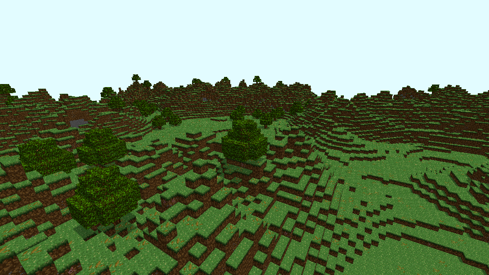

# Oak forests

New worlds use generator version 2. A separate seeded forest mask decorates
the existing plains/hills heightmap, so hills, soil depth, and seed-zero terrain
heights stay intact. The HUD reports `Forest` inside the new biome. Loaded
generator-1 worlds keep their original terrain and biome labels.

This capture uses the real terrain, shadow, and sky passes at the twelve-chunk
distance. It is a scripted renderer capture, without the gameplay HUD.

## Trees and ground

Each accepted tree has a four- or five-block upright trunk. Two broad canopy
layers have clipped corners, followed by a smaller crown and a cardinal cap.
The generator derives sites from signed eight-block cells and a seeded hash.
Sites use a broad Perlin forest mask and a 75% acceptance threshold. Canopies
can cross chunk boundaries. Every chunk evaluates a three-block site halo and
writes only its own cells, so generating chunks independently or in reverse
order gives the same result. Roots and canopies stay inside the finite world.
Sites beside cliffs are rejected when neighboring terrain would bury the crown.

The leafy-ground threshold is 80% within two blocks of a tree center, 35%
between two and three blocks, 10% elsewhere in a forest, and 2% elsewhere.
These are deterministic hash thresholds, not a guarantee for each small patch.
Leafy ground is saved as its own block ID and uses the supplied leafy top;
its sides and underside retain normal grass/dirt materials. Ordinary grass
also retains its existing 10% cosmetic leafy-top variant. The geometry of
the ground does not change.

| Block | Block ID | Item ID | Face textures | Hand time |
| --- | ---: | ---: | --- | ---: |
| Oak log | 7 | 11 | Bark on four sides, end grain on top/bottom | 1.5 s |
| Oak leaves | 8 | 12 | Supplied leaf tile on all faces | 0.2 s |
| Leafy grass | 9 | Drops grass item 1 | Leafy top, grass sides, dirt underside | 0.75 s |

The three oak PNGs are supplied 16×16 RGBA exports, kept identical in both
`art/` and `src/assets/textures/`. Texture layers 10, 11, and 12 hold bark,
end grain, and leaves. Explicit leafy ground uses existing layer 5. Original
block IDs 0–6, item IDs 0–10, and texture layers 0–9 keep their meaning.

Logs and leaves use solid-block selection and collision. Leaf alpha below 0.5
discards both color and depth in terrain, item, and shadow rendering. Opaque
neighbors retain their faces behind leaf gaps; adjoining leaf cubes share an
outer shell. Leaf rectangles never act as filled software occluders.
Logs drop their own item when broken. Leaves drop nothing, including when
dropped-item storage is full. Existing leaf items retain their ID, 999-item
stacking, held model, placement, and save support.
Placed logs remain upright. Put one log in any otherwise empty 2×2 crafting
grid square to make four oak planks. Output capacity is checked before
consuming the log; shift-click makes only complete recipes that fit.

The initial six hotbar stacks and leather equipment remain unchanged. Collect
logs from the forest. Breaking leaves does not provide a harvestable item.
Leafy grass drops ordinary grass, so no extra
leafy-ground inventory item is exposed.

## Saves and remaining work

The version-6 writer retains the full world snapshot and records its generator
version. Versions 1–5 still load with their original block/item meanings. A
loaded generator-1 world can be saved as format 6 without adding trees or
changing its generator. See [the save format](world-persistence.md).

Leaves retain solid-cube collision while their artwork has cutout gaps.
Translucent leaves, decay, saplings,
growth, additional tree families, log orientation, tools, and tool-specific
harvest behavior remain on the content roadmap. Increasing render distance
does not add streaming, larger world bounds, or distant LOD.

## Checks

CPU regressions retain generator-1 terrain fingerprints and verify v2
determinism, independent/reversed chunks, negative seams, tree shape, unchanged
terrain heights, ground enrichment, and rejected generator versions. World
meshes are compared against independently enumerated exposed unit faces.

Graphical fixtures compare all six tree/material faces to their PNGs and use
independent layer colors across signed seams and rebuilds. They also render a
generated forest with normal terrain shadows and sky. The real application
persistence harness places tree blocks through registered input callbacks and
checks their terrain, items, and counts after F5, clean exit, and restart.
These are scripted hidden-window checks; they do not establish physical-input
feel or long play-session behavior.

The cutout and interaction follow-up passes both native Windows Release and
Debug suites with MinGW GCC 13.2.0 and Intel UHD Graphics. Source-image probes
check all 42 transparent and 214 opaque leaf texels, background depth, bark behind
leaf gaps, and alpha-tested shadow depth. Callback tests confirm leaf removal
with empty/full drop storage and preserve ordinary log drops. Held-block checks
sample 21 phases for breaking and each hand's placement at three framebuffer
sizes and require zero arm pixels. Non-block equipment separately checks
fractional sleeves against independent alpha composites.
Crack checks cover six faces, growing coverage, cancellation, removal, foreground
occlusion, leaf gaps, and preserved depth. The repository CI repeats the CPU,
sanitizer, and graphical suites with GCC/Clang on Linux; current run results are
linked from PR #89.

The native build-cache regression also passes all 22 cases with
`powershell -NoProfile -ExecutionPolicy Bypass -File tests/test_build.ps1`.
Its header-isolation case uses `world.h`; `chunk.h` is a real dependency of
command-line render-distance validation and cannot serve as an unrelated-header
control for `options.o`.
